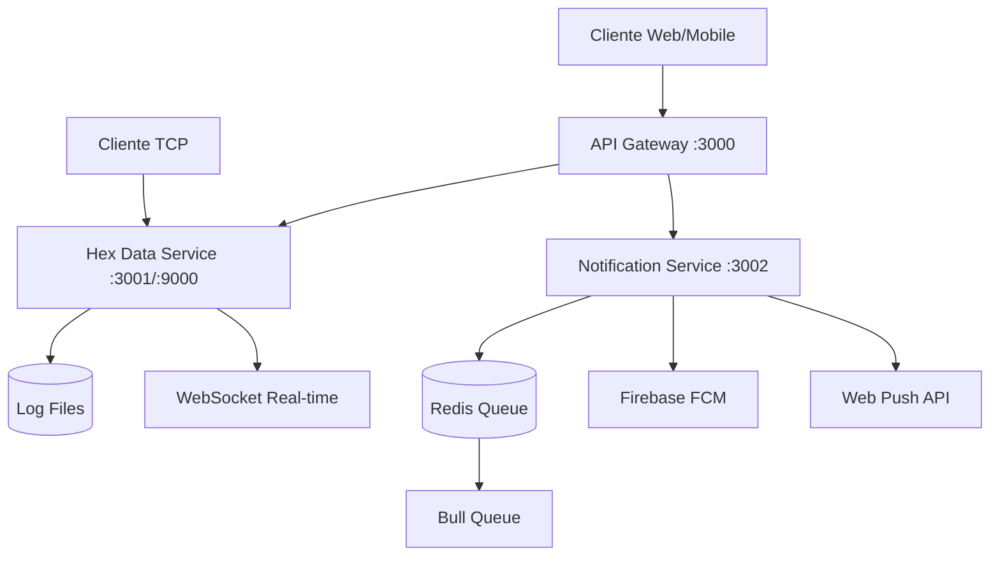

# Hex Microservices

Una arquitectura de microservicios moderna que transforma el servidor TCP original en un sistema escalable con notificaciones push para aplicaciones web y React Native.

## 🏗️ Arquitectura



### Servicios

1. **API Gateway** (Puerto 3000)
   - Punto de entrada único
   - Autenticación JWT
   - Rate limiting
   - Proxy inteligente

2. **Hex Data Service** (Puerto 3001 + TCP 9000)
   - Servidor TCP original migrado
   - APIs REST para consultar logs
   - WebSocket para datos en tiempo real
   - Compatibilidad total con cliente TCP existente

3. **Notification Service** (Puerto 3002)
   - Push notifications (FCM/APNs)
   - Web push notifications
   - Cola de mensajes con Redis
   - Reintentos automáticos

## 🚀 Inicio Rápido

### Requisitos
- Node.js 18+
- Docker & Docker Compose (opcional)

### Instalación Local

```bash
# Clonar e instalar dependencias
npm install

# Desarrollar todos los servicios
npm run dev:all

# O desarrollar servicios individuales
npm run dev:hex          # Solo hex-data-service
npm run dev:notifications # Solo notification-service
npm run dev:gateway      # Solo api-gateway
```

### Con Docker

```bash
# Desarrollo
docker-compose -f docker-compose.yml -f docker-compose.dev.yml up

# Producción
docker-compose up -d

# Ver logs
docker-compose logs -f

# Parar servicios
docker-compose down
```

## 📡 Endpoints API

### Autenticación

```bash
# Login (usuarios por defecto: admin/admin123, user/user123)
POST /api/auth/login
{
  \"username\": \"admin\",
  \"password\": \"admin123\"
}

# Registro
POST /api/auth/register
{
  \"username\": \"nuevo_usuario\",
  \"password\": \"password123\",
  \"role\": \"user\"
}

# Verificar token
GET /api/auth/verify
Authorization: Bearer <token>
```

### Datos Hex

```bash
# Obtener logs con paginación
GET /api/hex/logs?page=1&limit=50&clientIP=192.168.1.100

# Logs por cliente específico
GET /api/hex/logs/client/192.168.1.100

# Estadísticas
GET /api/hex/logs/stats

# WebSocket en tiempo real
ws://localhost:3000/socket.io
```

### Notificaciones

```bash
# Registrar dispositivo
POST /api/notifications/devices/register
{
  \"token\": \"device_fcm_token\",
  \"platform\": \"android\",
  \"userId\": \"user123\"
}

# Enviar notificación
POST /api/notifications/notifications/send
{
  \"deviceTokens\": [\"token1\", \"token2\"],
  \"payload\": {
    \"title\": \"Título\",
    \"body\": \"Mensaje\",
    \"data\": { \"custom\": \"data\" }
  }
}

# Notificación de prueba
POST /api/notifications/notifications/test
{
  \"deviceToken\": \"your_device_token\",
  \"platform\": \"android\"
}
```

### Health Checks

```bash
# Estado general
GET /api/health

# Estado de servicios
GET /api/health/services

# Estado del gateway
GET /api/health/gateway
```

## 🔧 Configuración

### Variables de Entorno

```bash
# API Gateway
JWT_SECRET=your-super-secret-jwt-key
ALLOWED_ORIGINS=http://localhost:3000,http://localhost:19006
HEX_DATA_SERVICE_URL=http://localhost:3001
NOTIFICATION_SERVICE_URL=http://localhost:3002

# Hex Data Service
TCP_PORT=9000
LOG_DIR=/var/www/html/hex-server

# Notification Service
REDIS_HOST=localhost
REDIS_PORT=6379

# Firebase (para push notifications móviles)
FIREBASE_SERVICE_ACCOUNT_KEY='{\"type\":\"service_account\",...}'

# Web Push (para notificaciones web)
VAPID_PUBLIC_KEY=your_vapid_public_key
VAPID_PRIVATE_KEY=your_vapid_private_key
VAPID_SUBJECT=mailto:admin@yourdomain.com
```

### Configuración de Firebase

1. Crear proyecto en [Firebase Console](https://console.firebase.google.com)
2. Generar clave de cuenta de servicio
3. Configurar `FIREBASE_SERVICE_ACCOUNT_KEY`

### Configuración de Web Push

```bash
# Generar claves VAPID
curl -X POST http://localhost:3002/api/web-push/generate-keys
```

## 📱 Integración con Clientes

### React Native

```javascript
// Instalar dependencias
npm install @react-native-firebase/app @react-native-firebase/messaging

// Registrar dispositivo
import messaging from '@react-native-firebase/messaging';

const registerDevice = async () => {
  const token = await messaging().getToken();
  
  await fetch('http://your-api/api/notifications/devices/register', {
    method: 'POST',
    headers: { 'Content-Type': 'application/json' },
    body: JSON.stringify({
      token,
      platform: Platform.OS,
      userId: 'current_user_id'
    })
  });
};
```

### Web App

```javascript
// Registrar Service Worker para Web Push
navigator.serviceWorker.register('/sw.js');

// Solicitar permisos y registrar
const registerWebPush = async () => {
  const registration = await navigator.serviceWorker.ready;
  
  const subscription = await registration.pushManager.subscribe({
    userVisibleOnly: true,
    applicationServerKey: 'your_vapid_public_key'
  });
  
  await fetch('/api/notifications/devices/register', {
    method: 'POST',
    headers: { 'Content-Type': 'application/json' },
    body: JSON.stringify({
      token: JSON.stringify(subscription),
      platform: 'web',
      userId: 'current_user_id'
    })
  });
};
```

### Cliente TCP (Compatible con servidor original)

```bash
# El servidor TCP sigue funcionando en el puerto 9000
echo \"Datos de prueba\" | nc localhost 9000
```

## 🔄 WebSocket en Tiempo Real

```javascript
import io from 'socket.io-client';

const socket = io('http://localhost:3000');

// Escuchar nuevas conexiones TCP
socket.on('tcp:connection', (data) => {
  console.log('Nueva conexión TCP:', data);
});

// Escuchar datos en tiempo real
socket.on('tcp:data', (data) => {
  console.log('Nuevos datos hex:', data);
});

// Unirse a sala específica
socket.emit('join-room', 'tcp-monitoring');
```

## 🧪 Testing

```bash
# Ejecutar tests
npm test

# Test de servicio específico
npm test --workspace=services/hex-data-service

# Linting
npm run lint
```

## 📊 Monitoreo

- **Redis Commander**: http://localhost:8081 (modo desarrollo)
- **Health Checks**: http://localhost:3000/api/health
- **Logs**: `docker-compose logs -f [service_name]`

## 🚢 Despliegue

### Producción

```bash
# Build y deploy
npm run build
docker-compose up -d

# Escalar servicios
docker-compose up -d --scale hex-data-service=3
```

### Variables de Producción

- Cambiar `JWT_SECRET`
- Configurar Firebase correctamente
- Usar Redis externo
- Configurar logs persistentes
- Habilitar HTTPS

## 🤝 Contribución

1. Fork del proyecto
2. Crear rama feature (`git checkout -b feature/AmazingFeature`)
3. Commit cambios (`git commit -m 'Add some AmazingFeature'`)
4. Push a la rama (`git push origin feature/AmazingFeature`)
5. Abrir Pull Request

## 📄 Licencia

MIT License - ver archivo `LICENSE` para detalles.

## 🆘 Soporte

- Crear issue en GitHub
- Revisar logs: `docker-compose logs -f`
- Health checks: `GET /api/health`